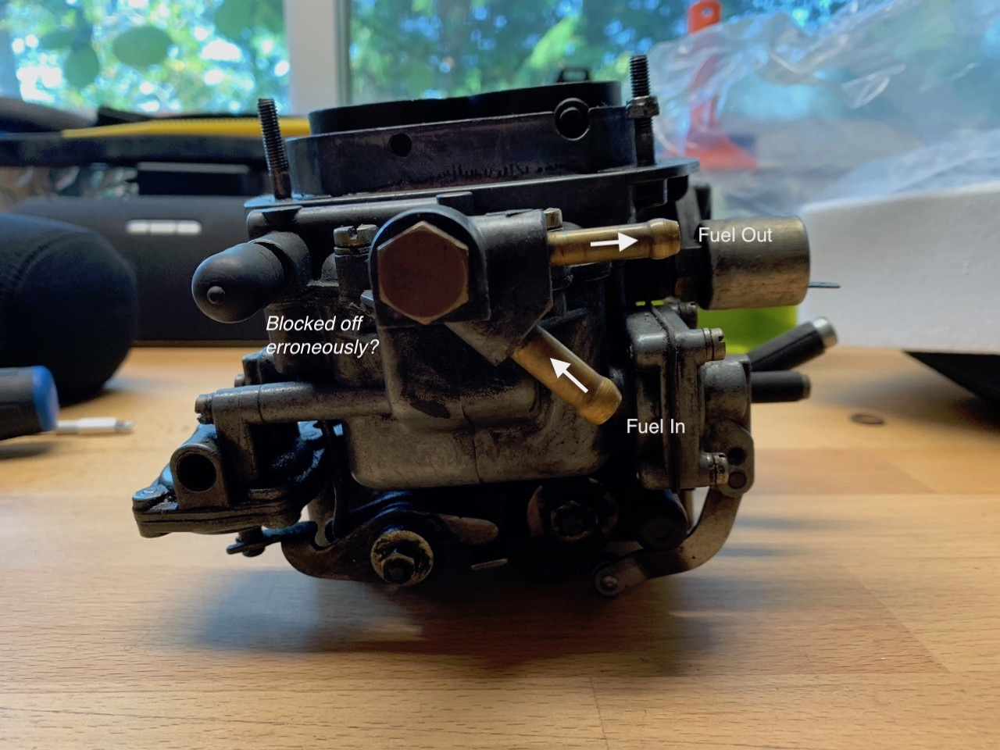
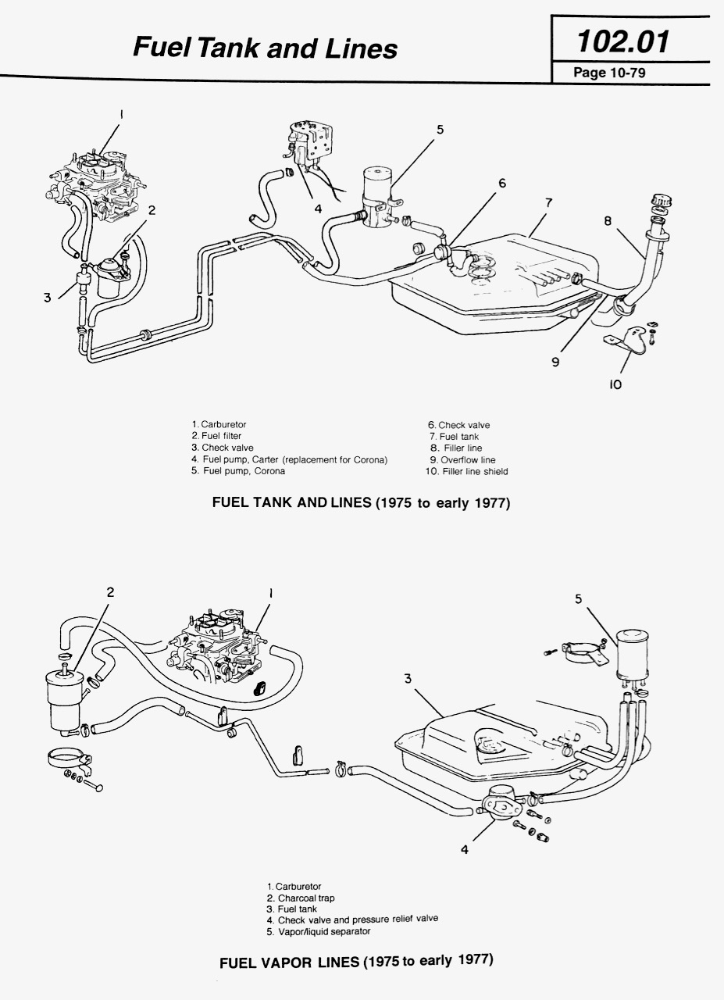
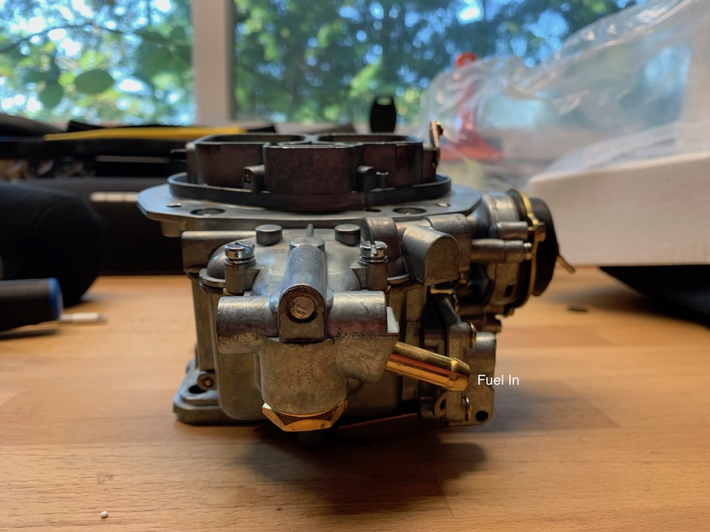
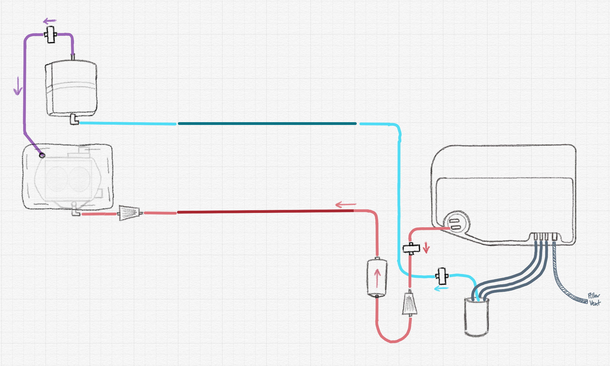

Hello everyone,

I'm in the middle of a mechanical freshening up of my 1975 spider. (Follow along over here: https://www.instagram.com/fiat142/)

In short it did run, however it was rough and needed new clutch, new engine seals, new water pump, new rear diff seals, etc etc.

So far the process has been a fun learning experience, however I've hit a snag in planning out the fuel system that I could use some advice on.

I'm looking to put a new 32/36 DFEV Carb on to give it a little more pep, and at the same time redoing the fuel system because it had some major rust issues (new tank, etc). I'm not entirely sure what the best setup would be.

It looks like the previous owner has removed every emissions regulation component on the car. It's pretty bare bones under the hood (which I like) - which makes it not match up perfectly with manuals and descriptions of other people's cars (which isn't great).

Below is a picture of the old system removed from the car as well as the existing 32 ADFA carb:

And here's a nice diagram to explain the current system. Yes, that's all the hoses that were hooked up - looks like they just blocked the vapor hose(s) that went into the charcoal canister?

Now, when comparing this to the various fuel diagrams from my shop manuals it looks like some obvious things were done: electric fuel pump in the trunk, no more check valves, and no more vapor collecting lines from the carb to the charcoal trap.

So, on new 32/36 DFEV Carb (https://autoricambi.us/products/carburetor-replacement-empi-3236-dfev) I'm noticing there's no return nubbin. I'd assume it's regulator is a bit more sophisticated and can just handle it..?

So based on the above my initial thoughts are:

- Delete the return line all together & close it off on the sender unit on the tank.
- Put a check valve back into the fuel line for funnies.
- Get a 2 port charcoal canister (like what's on a fuel injected spider)
  - Plum the canister up into the air filter (with check valve) similar to the crank case vapor line.

I'm super visual so to complete the thought here's a diagram of the new system. Note the direction of the fuel flow/check valves throughout.

Questions:

- Does this look like a sound plan? 
- Is there a way to simplify it even more?